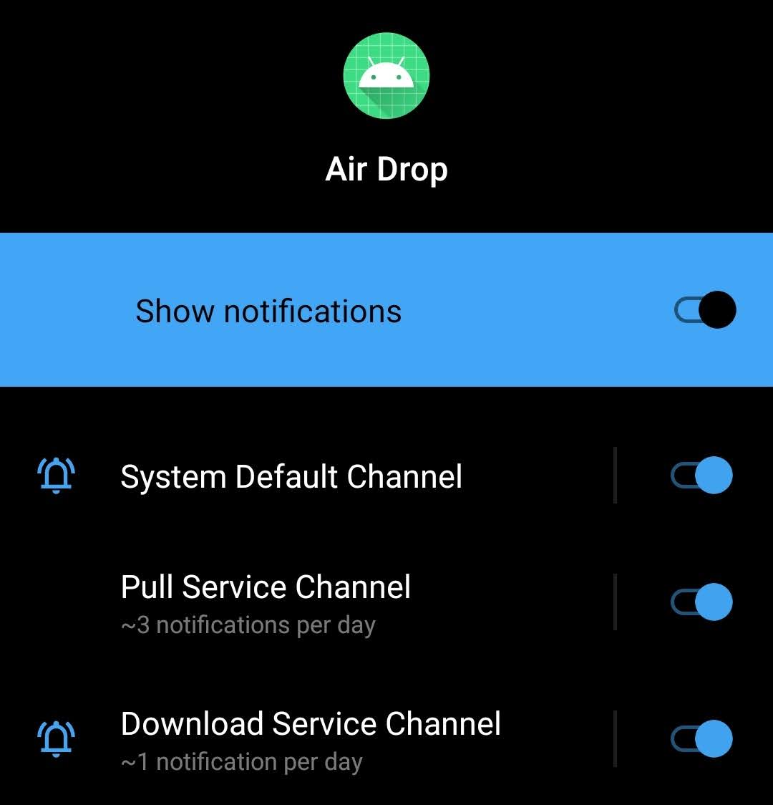

# Air Drop Android App

This repository contains all the code required to setup the Android Application required for Air Drop service.

## Infrastructure


The infrastructure has the following components:
1. Google Cloud Storage Bucket.
2. GCS Fuse.
3. Cloud Function.
4. Pub/Sub.
5. API Server.
6. Android App.

## Components

### Google Cloud Storage Bucket

The storage bucket is needed to, well, store all the files. 

It can be created either from the command line or from the google cloud console.

GCS Fuse would mount this storage bucket onto the local filesystem.

### GCS Fuse

GCS Fuse is a tool developed to mount a google cloud storage bucket as an external disk in your local file system.

This is a necessary component in the system, as with this we would be creating a folder which would serve as a sink.

Any file added to this folder automatically would be automatically uploaded to the GCS Bucket, and thus be available to download on the mobile device.

Steps for installation and mounting can be found [here](https://github.com/GoogleCloudPlatform/gcsfuse).

### Cloud Function

The cloud function is triggered when an object is uploaded into the bucket.

The cloud function has one purpose: Feed the newly uploaded file to the pub/sub. 

It extracts the filename from the event object, and pushes the same into the pub/sub.

### Pub/Sub

Pub/Sub or Publisher/Subscriber is a powerful message queue in the Google Cloud environment.

As the name suggests, it needs to have a publisher and a subscriber, thus there are two components in the Pub/Sub:
1. Topic.
2. Subscription.

A topic is a queue into which you push the data. A subscription is a piece of code that consumes the messages in the topic.

A subscription is attached to a specific topic.

In general there are two types of subscriptions:
1. Push.
2. Pull.

In the Push mechanism, you specify an endpoint, and Google will trigger that endpoint and pass the payload from the topic.

In the Pull mechanism, the code needs to constantly listen and check if there are any new messages in the topic.

For our use-case, we would be using a Pull subscription. As there is an API which checks if there are any messages in the topic.

### API Server

We have a small flask server containing three APIs. 

1. GET /api/health
2. GET /api/pull
3. GET /api/download

## Android Application

Before you actually start reading the explanation of the code, you should check out the these two videos:
1. [How to Start a Foreground Service in Android (With Notification Channels)](https://www.youtube.com/watch?v=FbpD5RZtbCc)
2. [How to Start a Background Thread in Android](https://www.youtube.com/watch?v=QfQE1ayCzf8&list=PLrnPJCHvNZuD52mtV8NvazNYIyIVPVZRa)

These two videos by [Coding In Flow](https://www.youtube.com/channel/UC_Fh8kvtkVPkeihBs42jGcA) were crucial to build this small application.

They would surely appreciate a new subscriber and a like on their videos!

### Components

There are three main components of the application:
1. Notification Channel.
2. Foreground Service.
3. Background Thread.

#### Notification Channel

From Android O onwards, a notification channel is required to display notifications.



For our application, there are two notification channels:
1. Pull Service Channel.
2. Download Service Channel.

The Pull Service Channel shows the notification for the foreground service.

The Download Service Channel shows the notifications for the new files to download.

The code to create the notification channel is added to the App class onCreate:
```java
if (Build.VERSION.SDK_INT >= Build.VERSION_CODES.O) {
        NotificationChannel downloadChannel = new NotificationChannel(
            DOWNLOAD_CHANNEL_ID,
            "Download Service Channel",
            NotificationManager.IMPORTANCE_DEFAULT
    );

    NotificationManager manager = getSystemService(NotificationManager.class);
    manager.createNotificationChannel(downloadChannel);
}
```

#### Foreground Service

To create a service, create a new class extending the android.app.Service class.

We need to override the following methods:
1. onCreate
2. onStartCommand
3. onDestroy
4. onBind

onCreate is called when the service is created.

onStartCommand is executed whenever the service is started. The onCreate method is executed only once, however the onStartCommand is executed whenever the service is started.

onDestroy is called when the service is destroyed.

onBind is used to interact with the service. It is a compulsory method to override. We would be leaving it as it is.

On the service startup, a notification would be created:
```java
Intent notificationIntent = new Intent(this, MainActivity.class);
PendingIntent pendingIntent = PendingIntent.getActivity(this, 0, notificationIntent, 0);

Notification notification = new NotificationCompat.Builder(this, SERVICE_CHANNEL_ID)
    .setContentTitle("Air Drop Pull Service")
    .setSmallIcon(R.drawable.ic_pull_service_icon)
    .setContentIntent(pendingIntent)
    .build();

startForeground(1, notification);
```  

The `startForeground` function is used to start a foreground service.

#### Background Thread

The background thread is started by the foreground service. 

The background thread performs two tasks:
1. Constantly check if any new files are added.
2. If new files are added, create a notification.

To constantly check if new files are added, we are going to run an infinite loop of HTTP Get Requests to "/api/pull".

```java
URL url = new URL(this.pullEndpoint);
HttpURLConnection httpURLConnection = (HttpURLConnection) url.openConnection();
httpURLConnection.setRequestMethod("GET");

int responseCode = httpURLConnection.getResponseCode();
``` 

The response we get is:
```json
{
  "count": 2, 
  "data": [
    "filename1",
    "filename2"
  ], 
  "success": true
}
```

If the `count` is greater than 0, then we iterate over the data array and create notifications with the filenames.

The catch here is, if you click on the notification, you are automatically redirected to the "/api/download" URL. So that the file starts to download automatically.

The way to build such a notification is:
```java
Intent notificationIntent = new Intent(Intent.ACTION_VIEW, Uri.parse(downloadEndpoint + filename));
PendingIntent pendingIntent = PendingIntent.getActivity(context, 0, notificationIntent, PendingIntent.FLAG_ONE_SHOT);

NotificationCompat.Builder builder = new NotificationCompat.Builder(context, DOWNLOAD_CHANNEL_ID)
    .setContentTitle(filename)
    .setSmallIcon(R.drawable.ic_pull_service_icon)
    .setContentIntent(pendingIntent);

int notificationId = random.nextInt(50) + 1;

NotificationManagerCompat notificationManager = NotificationManagerCompat.from(context);

notificationManager.notify(notificationId, builder.build());
```
